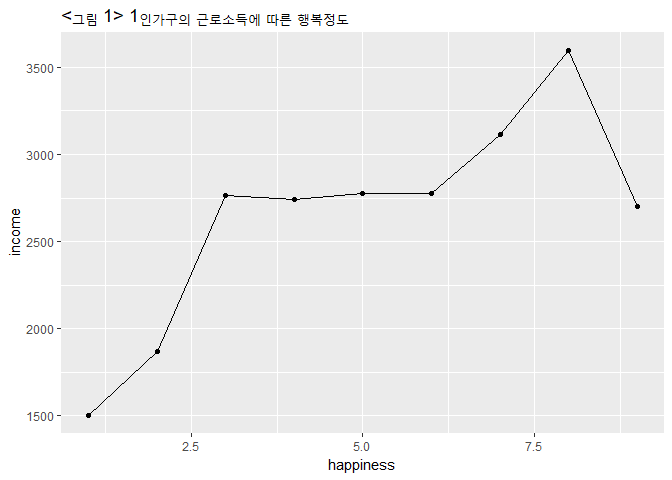
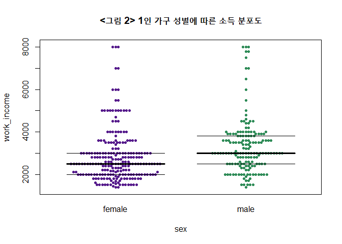
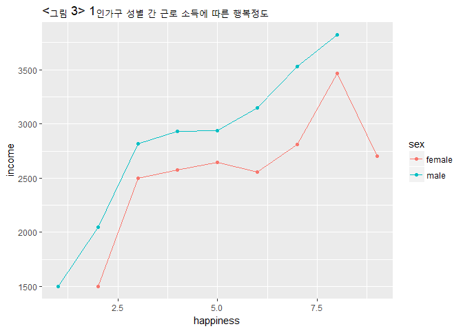

1인 가구의 행복에 관한 문제
================

### 1. 서론

서울에 거주하는 1인 가구의 행복 지수는 어떻게 될까? 대한민국 사회에서 1인 가구의 비중은 갈수록 높아지고 있다. 통계청은 2045년에 1인 가구 수가 총 810만 가구가 될 것이라고 예상하는데, 이는 전체 가구의 약 36%에 해당하는 수치이다.[1] 2018년 현재 1인 가구의 비중을 알 수 있는 데이터는 2015년에 마지막으로 실시한 인구주택총조사로부터 나오며, 그 수치는 518만 가구, 전체 가구 중 약 27%를 차지하고 있다. 현재 1인 가구는 연령대 별 분포가 골고루 이루어져 있는 만큼 1인 가구의 원인 또한 취업난, 만혼, 이혼, 황혼 등 골고루 나타나고 있다. 그러나 갈수록 고령화 사회로 인한 노인층의 문제가 크게 두각을 나타내면서 2045년에는 60대 이상의 1인 가구가 전체에서 큰 비중을 차지할 전망이다.

이처럼 1인 가구의 수치 및 비중은 사회의 다양한 문제가 낳은 결과이기도 하다. 따라서 1인 가구에게 행복지수를 묻는 것은 현재 사회 문제에 직면한 사람들에게 행복지수를 묻는 것이며, 정책의 궁극적인 목표인 삶의 질 향상에 있어서 실증적인 문제 해결을 위한 질문이라고 해석할 수 있다. 필자는 이 글을 통해 '소득 수준이 높을 수록 행복지수가 높을 것'으로 보고 두 변수 간에 양의 상관관계가 있다는 가설을 세우고 실제로 그러한지 알아보고자 한다. 또한 1인 가구의 행복 지수를 묻기 전에 전체 1인 가구 중 생산활동이 가능하면서 현재 노동활동만으로 생계를 꾸려가는 사람들을 추려내어 그들의 행복지수를 묻고자 한다. 그 이유로 정상적인 노동 활동을 통해 생계를 꾸려나가는 일반적인 가구를 관측치로 정하기 위해서이다. 초반의 결과가 예상과는 다르게 나타면서, 데이터를 정제하면서 실증적으로 해석할 수 있는 수치를 얻어가는 노력을 하였다. 그러나 그 과정에서 자료가 가진 한계점이 드러났는데, 자세한 내용은 4절에서 결론과 함께 다룰 예정이다.

### 2. 데이터 분석

#### 1) 데이터 선정

먼저 분석에 필요한 패키지와 데이터 자료를 다운받는다.

``` r
library(readxl)
library(dplyr)
```

    ## 
    ## Attaching package: 'dplyr'

    ## The following objects are masked from 'package:stats':
    ## 
    ##     filter, lag

    ## The following objects are masked from 'package:base':
    ## 
    ##     intersect, setdiff, setequal, union

``` r
library(ggplot2)

# 원자료를 받은 후에 사본을 만든다
raw_welfare <- read_excel("2015_서울복지실태조사_데이터.xlsx")
welfare <- raw_welfare

# Excel 자료 출처 : 서울연구데이터서비스
```

자료(2015\_서울복지실태조사\_데이터.xlsx)는 '닐슨 코리아'가 '서울시'와 '서울연구원'으로부터 의뢰를 받아 실시한 설문조사이다. 서울시 가정의 생활실태와 복지실태를 조사하기 위한 질문들로 구성이 되어 있다. 자료에서 변수명은 코드북을 참고해야만 해석할 수 있기 때문에, 가독성을 높이기 위해 조사자료의 데이터 명을 바꿔주는 작업을 실시한다. 데이터 전체를 작업할 수 있으면 좋겠지만 변수의 개수 때문에 한계가 있고, 코딩의 무게를 줄이기 위해 구하고자 하는 항목의 값만 바꿔주도록 한다. 추가적으로, 한글로 변수명을 설정하는 작업 중 변수가 누락되는 현상이 발견되었기 때문에 안전성을 위해 변수명을 영어로 설정하였다.

``` r
welfare <- rename(welfare,
                  family1 = A1_2_1,       # A1_2_1   : 가구주
                  family2 = A1_2_2,       # A1_2_2   : 2번 째 가구원
                  sex = A1_3_1,           # A1_3_1   : 성별 항목
                  age = A1_4_1_1,         # A1_4_1_1 : 나이 항목으로 결과값은 출생연도
                  can_work = B1_1_1,      # B1_1_1   : 노동 능력 상태
                  do_work = B1_3_1,       # B1_3_1   : 노동 상태
                  work_time = B1_6_1,     # B1_3_1   : 근로 시간
                  work_income = B10_1,    # B1_3_1   : 근로 소득
                  happiness = F3)         # F3       : 행복 수준 (행복 정도)


# sex 항목의 1값은 남자, 2값은 여자이다.
welfare$sex <- ifelse(welfare$sex ==1, "male", "female")   

# can_work 항목의 값이 1이면 근로 가능, 이외에는 일반적인 수준에서 불가능하다.
welfare$can_work <- ifelse(welfare$can_work == 1, "can", "cannot")

# do_work 항목이 9이면 비경제활동인구, 이외에는 경제활동인구이다.
welfare$do_work <- ifelse(welfare$do_work == 9, "donnot", "do")
```

다음으로는 1인가구를 선정하고 평균 근로소득에 따른 행복정도를 구하면 다음과 같다.

``` r
# 1인가구 행복정도에 따른 평균 근로소득
welfare %>% 
  filter(is.na(family2),
         can_work == "can", 
         do_work == "do") %>%
  group_by(happiness) %>% 
  summarise(income = mean(work_income))
```

    ## # A tibble: 10 x 2
    ##    happiness  income
    ##        <dbl>   <dbl>
    ##  1        1.   1500.
    ##  2        2.   1867.
    ##  3        3.   1703.
    ##  4        4.   2044.
    ##  5        5.   1600.
    ##  6        6.   9164.
    ##  7        7.   2472.
    ##  8        8.   3110.
    ##  9        9.   2800.
    ## 10       10. 999999.

먼저 간단히 데이터 전처리 과정을 해석하면 다음과 같다. 가구원이 가구주 외에 없을 때, 즉 family2값이 NA일 때 1인가구이다. 1인가구 여부를 묻는 문항(A1\_10 == 1)은 추가하여도 측정값이 변하지 않으므로 제외시켰다. 또한 근로 가능 상태(can\_work == "can")이며, 노동 활동 중(do\_work == "do")인 사람을 대상으로 한다. 행복지수는 1에서부터 10까지의 결과값을 가지며 숫자가 클수록 더 행복하다고 응답한 것이다.

주어진 결과값만을 놓고 본다면 1인가구의 행복지수는 근로소득 정도와 큰 상관관계가 없는 것으로 보인다. 그러나 우리가 구하고자 하는 '노동활동 중인 생산가능인구'를 일반적으로 잘 추론해냈는지 살펴볼 필요가 있다.

#### 2) 데이터 정제

먼저 근로소득이 0인 극단치의 경우이다. 이 범위에 있는 사람들의 월 평균 생활비 지출액(B2 항목)의 평균이 151만원으로 소득이 0이 아닌 사람들의 평균인 153만원과 불과 2만원밖에 차이가 나질 않았다. 확인해보니 근로소득이 0인 범위에 속한 대부분의 사람들은 사업소득(B10\_2 항목)이 연평균 2,861만원로 나타나는 사업자인 것으로 나타난다. 예컨대 사업가도 근로자는 맞지만, 여기에서는 노동에 대한 대가로 생계를 꾸리고 있는 생산가능인구를 찾고자 하기 때문에 근로소득이 0인 경우를 제외하고자 한다. 사업자가 아닌 경우에도 같은 데이터 정제의 이유로 제외하고자 한다.

``` r
# 근로소득이 0인 1인 가구 
welfare %>% 
  filter(is.na(family2),
         can_work == "can", 
         do_work == "do",
         work_income == 0) %>% 
  summarise(business_income = mean(B10_2))          # 평균 사업소득
```

    ## # A tibble: 1 x 1
    ##   business_income
    ##             <dbl>
    ## 1           2861.

다음으로는 근로소득이 측정 최대치인 999,999만원이거나 예상할 수 있는 근로소득 수치를 크게 벗어나는 극단치의 경우이다. 이에 포함된 사람들의 연 소득세의 평균값(B4 항목)이 연 160만원이며 극단치를 제외한 대다수, 즉 이들보다 평균 근로소득이 훨씬 적은 사람들의 연 소득세의 평균값인 480만원보다 오히려 낮게 나타나고 있다. 물론 세액공제의 개인차로 소득세가 낮게 나올 수도 있지만, 소득 수준이 낮은 군에 비해 더 적은 값이 나오기 때문에 상식적으로 신뢰할 만한 데이터라고 생각하기 어렵다. 따라서 극단치도 이상치라고 판단하여 제외하고자 한다.

``` r
# 근로 소득이 극단치로 높은 1인 가구
welfare %>% 
  filter(is.na(family2),
         can_work == "can", 
         do_work == "do") %>%
  arrange(desc(work_income)) %>% 
  head(3) %>%                   # 관측치 값이 3인 이유는 이후의 가구 설정을 참고하였다.
  summarise(work_income_tax = mean(B4))        # 평균 연 소득세
```

    ## # A tibble: 1 x 1
    ##   work_income_tax
    ##             <dbl>
    ## 1            160.

그렇다면 극단치 값을 정확하게 어떻게 설정해야 할까? 극단치를 정하는 값은 주관적인 생각에 따라 다를 것이다. 누구는 근로소득에 극단치 값이 있어도 제외하지 않는 것이 맞다고 생각할 수도 있겠으나, 필자는 노동을 주된 생산 활동으로 하고 있는 일반적인 1인 가구의 근로소득을 비교하여 행복지수를 구하고자 한다. 여기에 대해서는 설문지 E3 문항을 참고하여 극단치 값을 설정하였다.

설문지의 E3 문항에서는 참고 설명으로 긴급복지지원이 시행되는 가구는 가구소득이 최저 생계비의 185% 이하인 가구를 대상으로 실시하며 그 값은 1인가구의 경우에 월 114만원을 기준으로 한다는 것을 알려주고 있다. 이를 바탕으로 연평균 근로소득(work\_income)이 약 1,364만원 이하인 가정은 일반적인 범위에서 제외시켰다. 복지 정책의 혜택을 받아 순수하게 노동으로 얻은 소득을 측정하기 힘들기 때문이다. 아울러 최저 수준의 반대편에 있는 극단치도 값을 지정해야하는데, 상식적인 수준에서 정할 수 있게 최저생계비의 10배 수준인 13,640만원으로 잡았다. 이 경우 제외된 가구는 총 3가구로, 제외하는 작업이 주관적인 측면이 있으나 큰 차이를 야기할 것으로 보기 힘들다. 이렇게 설정한 값의 조건은 근로소득만을 전체 가구소득으로 계산한다고 가정해야만 결과가 성립한다. 따라서 근로소득 이외의 소득은 0인 가구를 산정하며 근로소득을 이하 소득이라고 총칭하여 부르겠다.

``` r
# 노동 활동 중인 생산가능 1인가구를 임의의 데이터로 지정한다.
person <- welfare %>% 
  filter(is.na(family2),
         can_work == "can", 
         do_work != "donnot", 
         work_income > 1364,
         work_income < 13640,
         B10_2 == 0,
         B10_3 == 0,
         B10_4 == 0,
         B10_5 == 0,
         B10_6 == 0,
         B10_7 == 0)         # B10_2 ~ B10_7 문항은 근로 이외의 소득항목이다.
```

#### 3) 데이터 정제 결과

데이터 전처리 후 다시 결과값을 구하면 1인가구의 행복지수는 다음과 같다.

``` r
# 그래프로 만들 프레임을 생성한다.
graph_happy <- person %>% 
  group_by(happiness) %>% 
  summarise(income = mean(work_income, na.rm = T))

# 그래프를 그린다.
ggplot(data = graph_happy, aes(x = happiness, y = income)) +
  ggtitle("<그림 1> 1인가구의 근로소득에 따른 행복정도") + 
  geom_line() +
  geom_point()
```



그래프에서 소득이 행복 정도가 3점일 때까지 상승하지만 3점에서 6점까지는 약 2750만원 선에서 정체, 이후 8점까지는 다시 상승하며 9점에서는 정체구간보다 낮은 평균 소득이 나타난다.

### 3. 문제 해결

그렇다면 행복지수 3점에서부터 6점까지 일어나는 정체구간은 어떻게 설명해야 하는가? 또한 9점에서의 결과값이 예상과는 너무 다르게 나타나고 있는데, 과연 <그림 1>로 행복지수와 근로소득 간의 양의 상관관계가 있다고 해석할 수 있을까? 아니면 소득이 2,750만원이라는 일정 수준에서의 행복지수는 개인차에 의해서 또다른 원인으로 분류된다고 말해야 할까?

이 문제를 해결하기 위하여 행복지수가 9점인 경우의 공통점을 살펴본 결과 관측치가 전부 여성이라는 것을 발견할 수 있었다. 이를 토대로 성별에 따른 행복지수의 차이가 포함되어 있는 것을 생각해볼 수 있다. 문제 해결을 위해 먼저 성별에 따른 소득 분포를 비교해보기 위해서 새로운 R패키지를 이용하여 그래프로 나타내면 다음과 같다.

``` r
# 새로운 패키지 추가 및 패키지를 불러오는 작업을 수행한다.
# install.packages('beeswarm')              #새로운 패키지가 없다면 다운로드한다.
library(beeswarm)

beeswarm(work_income ~ sex, person,              # 성별에 따른 소득수준 분포도를 의미한다.
         col=sample(colors(), 27),               # 값에 샘플로 색상을 입힌다.
         pch=19,                                 # 포인트(원) 값의 선명도를 나타낸다.
         method="swarm",                         # 메소드 값을 "swarm"로 지정한다.
         cex=0.7,                                # 포인트 값의 크기를 나타낸다.
         main = "<그림 2> 1인 가구 성별에 따른 소득 분포도")  # 제목을 정해준다.
bxplot(work_income ~ sex, data = person, add = TRUE)  # 1/4분위, 평균, 3/4분위 값을 나타내는 선을 나타낸다.
```



``` r
# 남성의 평균 소득
person %>% 
  filter(sex == "male") %>% 
  summarise(income = mean(work_income, na.rm = T))
```

    ## # A tibble: 1 x 1
    ##   income
    ##    <dbl>
    ## 1  3309.

``` r
# 여성의 평균 소득
person %>% 
  filter(sex == "female") %>% 
  summarise(income = mean(work_income, na.rm = T))
```

    ## # A tibble: 1 x 1
    ##   income
    ##    <dbl>
    ## 1  2825.

남성의 평균 소득이 여성보다 높게 나타나는 정도가 크다. <그림 2>에서 남성의 평균 소득이 여성의 소득 3/4분위에 있는 수치와 가깝다. 이는 남녀간의 소득격차를 단적으로 보여주고 있으며 행복 지수가 소득격차에 의해 변형될 가능성을 시사하고 있다. 따라서 남녀 간의 소득에 따른 행복정도를 따로 알아보아야 한다. 다만 조심해야 할 점은 남녀 간 임금격차가 크다고 하는 것이 실질적인 차이인지 아닌지 하는 문제는 별개의 문제라는 점이다. 여기에서는 개개인의 소득과 행복지수만을 필요로 하기 때문에 임금격차가 실질적으로 차이가 나는지 묻는 문제는 생각하지 않기로 한다. 이를 바탕으로 정제된 데이터를 가지고 남녀의 소득 대비 행복정도를 나타내면 다음과 같다.

``` r
# 성별을 추가하여 그룹화하고, 소득 통계를 낸다.
sexual_graph <- person %>% 
  group_by(sex, happiness) %>% 
  summarise(income = mean(work_income, na.rm = T))

# 그래프로 나타낸다.
ggplot(data = sexual_graph, aes(x = happiness, y = income, group = sex, color = sex)) +
  ggtitle("<그림 3> 1인가구 성별 간 근로 소득에 따른 행복정도") +
  geom_line() +
  geom_point()
```



9점에서의 값은 우선 따로 생각하지 않고, 여성의 행복지수 중 6점에서 나타난 반전만을 제외하면, <그림 1>에서 나타나는 결과와는 다르게 남녀 모두 그래프 값이 꾸준한 상승세를 보이고 있다. 또한 같은 소득수준이더라도 성별에 따라 행복정도의 차이가 있는 것으로 보인다. 추가적으로 다음의 데이터 전처리를 보면 새로운 해석을 할 수 있다.

``` r
# 행복 지수가 3일 때의 관측치 값
person %>% 
  filter(happiness == 3) %>% 
  select(sex) %>% table
```

    ## .
    ## female   male 
    ##      1      5

``` r
# 행복 지수가 6일 때 관측치 값
person %>% 
  filter(happiness == 6) %>% 
  select(sex) %>% table
```

    ## .
    ## female   male 
    ##     61     36

행복 지수가 3일 때의 관측치의 값에는 남성의 수가 5배 많이 나타난다. 이로 인해 전체 평균의 값이 소득이 높은 남성 쪽으로 쏠리게 되며 행복지수가 3일 때의 전체 평균 소득이 높아지게 된다. 반대로 행복 지수가 6일 때의 관측치 값은 여성이 남성보다 약 2배 더 많기 때문에 평균 소득이 낮아지게 된다. 따라서 <그림 1>의 행복지수의 3점부터 6점 구간에서 평균 소득이 정체 구간과 같이 나타나는 것이다. 최종적으로 <그림 1>에서의 정체구간은 남녀의 임금격차로부터 나타난 결과이며, 성별에 따라 행복정도를 분리해보았을 때 여성의 행복지수가 6인 구간에서 나타나는 약간의 반전과 9점에서 나타나는 예외 부분을 제외하면 1인 가구의 행복지수는 근로 소득과 양의 상관관계를 가진다고 말할 수 있다.

### 4. 결론

필자는 노동 활동 중인 생산 가능한 1인 가구를 중심으로 근로 소득에 따른 행복정도를 구하고자 하였다. 데이터 분석 결과, 전체 1인 가구의 분석값보다 성별을 기준으로 분석한 값이 행복지수 측정에 더 정확한 자료임을 확인하였다. 따라서 분석결과는 <그림 3>이 대체로 더 잘 나타내고 있는데, 여성에게서 나타나는 예외적인 부분을 제외하면 '소득 수준이 높을 수록 행복정도가 높을 것이다'는 가설과 거의 일치하는 모습을 보이고 있다.

그러나 데이터가 가진 한계점을 많이 느낀 결과이기도 하다. 먼저 정제된 관측치가 부족했다. 전반적인 관측치가 행복지수 4점에서 7점 사이에 몰려있어서 이 범위 밖에서 나타나는 결과값이 유의미하다고 보기 힘들 수도 있다. 또한 가설의 결과라고 말할 수 있는 <그림 3>의 값에 여성에게서 나타난 예외 부분이다. 행복지수 6점에서 나타난 반전과 9점에서 나타난 예외 부분을 해석할만한 이렇다할 결과를 내놓지 못하였다. 업직종별로 쪼개서 분석하려는 시도는 해 보았으나, 분류했을 때 대부분의 관측치 값이 유의미한 수준까지 나오지 않는다는 한계가 있었다. 이 부분은 과연 개인 차이 때문인지, 만약 그렇다면 그 차이는 어디서부터 오는지 알아보는 작업은 추후 과제로 남겨둔다.

그래프 자체의 한계점도 크다고 느낀다. 예를 들어 보유 부동산 자산은 9,999,999(만원)이라고 응답을 하면서 부동산 소득이 너무 적은 경우이다. 심지어 0값이 가장 많은 관측치이다.

``` r
welfare %>% 
  filter(B16_1 == 9999999) %>%      # B16_1 : 보유 부동산 자산 총액
  select(B10_4) %>%                 # B10_4 : 총 부동산 소득
  arrange(B10_4) %>% table
```

    ## .
    ##      0      9 999999 
    ##     36      1     12

이러한 결과는 데이터 자체의 신뢰성에 대한 의심을 하기에 충분하며 데이터 정제를 하더라도 그 값이 과연 유의한지 의심을 할 수 있다. 때문에 응답자가 사실만을 적었는지 의심을 가질만한 데이터라는 한계점을 드러내고 있다고 볼 수 있다.

------------------------------------------------------------------------

[1] 통계청 장래가구추계 자료 <http://kostat.go.kr/portal/korea/kor_nw/3/index.board?bmode=download&bSeq>=&aSeq=359964&ord=3
